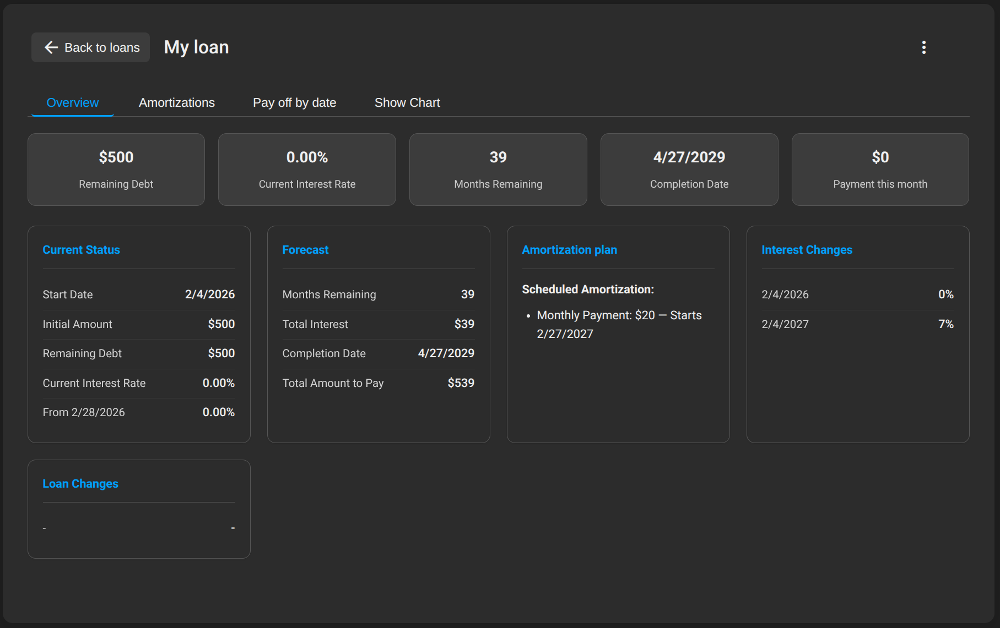

# Lendpile

**Version 0.2.1**

A loan and amortization tracker. Plan what you borrow or lend, see schedules and charts, and optionally sign in to sync across devices.

## What it does

- Add loans (amount, rate, currency, start date) and model interest and loan-amount changes over time.
- Set up amortization plans (one-off or recurring) and view the full schedule and chart.
- Track borrowing and lending. Export/import JSON; use with or without an account.
- Sign in for sync with Neon Auth and Neon Postgres. Share a loan via link (view-only or editable).

*Not financial advice. Confirm numbers with your lender or adviser. See [privacy.html](privacy.html) for disclaimer and privacy.*

## Quick start

1. **Clone** the repo.
2. **Config (for sync):** Copy `config.example.js` → `config.js`, add `LENDPILE_API_URL` and `NEON_AUTH_URL`. (`config.js` is gitignored.)
3. **Serve** the app (e.g. `npx serve .`) and open `/` for landing or `/app.html` for the app.
4. **Neon:** Enable Neon Auth, run `neon/schema.sql`, deploy the Worker, and add your local/deployed origins to Neon Auth trusted origins.

Use the app: add a loan, set amortization, open it to see the table and chart. Choose “Continue without an account” to use it with data only in this browser.

## Full documentation

Setup, deployment (e.g. Cloudflare Pages + Worker), admin, database schema, and reference: **[docs/README.md](docs/README.md)**.

## License

[CC BY-NC 4.0](LICENSE) — free for non-commercial use. By [hoozter](https://hoozter.com).
